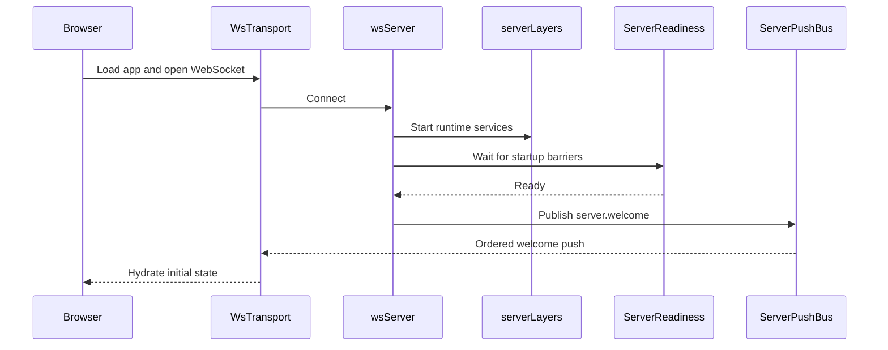
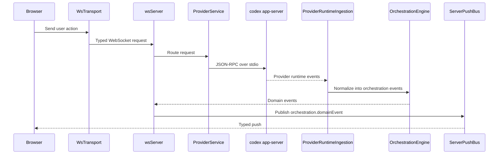
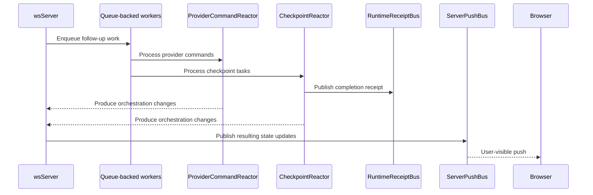

# Architecture / 架构设计

## System Overview / 系统概览

Peak Code runs as a **Node.js WebSocket server** that wraps `codex app-server` (JSON-RPC over stdio) and serves a React web app.

Peak Code 作为 **Node.js WebSocket 服务器**运行，包装 `codex app-server`（通过 stdio 进行 JSON-RPC 通信）并提供 React Web 应用。

```
┌─────────────────────────────────────────────────────────────────┐
│                      Browser (React + Vite)                     │
│    wsTransport (state machine) • Typed push decode at boundary  │
│    Components • Stores • Hooks • Native API                     │
└─────────────────────────────┬───────────────────────────────────┘
                              │ ws://localhost:3773
┌─────────────────────────────▼───────────────────────────────────┐
│                 apps/server (Node.js)                           │
│  WebSocket + HTTP static server • ServerPushBus (ordered pushes)│
│  ServerReadiness (startup gate) • OrchestrationEngine           │
│  ProviderService • CheckpointReactor • RuntimeReceiptBus        │
└─────────────────────────────┬───────────────────────────────────┘
                              │ JSON-RPC over stdio
┌─────────────────────────────▼───────────────────────────────────┐
│                    codex app-server                             │
└─────────────────────────────────────────────────────────────────┘
```

---

## Components / 组件

### Browser App / 浏览器应用

The React app renders session state, owns the client-side WebSocket transport, and treats typed push events as the boundary between server runtime details and UI state.

React 应用渲染会话状态，管理客户端 WebSocket 传输，并将类型化推送事件作为服务器运行时细节与 UI 状态之间的边界。

**Key Features / 主要功能**:

- Session management UI / 会话管理界面
- Code editor integration / 代码编辑器集成
- Terminal emulator / 终端模拟器
- Real-time chat interface / 实时聊天界面
- Theme system / 主题系统

### Server / 服务器

`apps/server` is the main coordinator. It serves the web app, accepts WebSocket requests, waits for startup readiness before welcoming clients, and sends all outbound pushes through a single ordered push path.

`apps/server` 是主协调器。它提供 Web 应用服务，接受 WebSocket 请求，在欢迎客户端之前等待启动就绪，并通过单个有序推送路径发送所有出站推送。

**Key Features / 主要功能**:

- WebSocket server / WebSocket 服务器
- HTTP static file serving / HTTP 静态文件服务
- Session management / 会话管理
- Provider orchestration / 代理编排
- Git integration / Git 集成
- Terminal management / 终端管理

### Provider Runtime / 代理运行时

`codex app-server` does the actual provider/session work. The server talks to it over JSON-RPC on stdio and translates those runtime events into the app's orchestration model.

`codex app-server` 执行实际的代理/会话工作。服务器通过 stdio 上的 JSON-RPC 与其通信，并将这些运行时事件转换为应用的编排模型。

**Supported Providers / 支持的代理**:

- Claude Code
- Codex
- Gemini
- Kilo Code
- OpenCode

### Background Workers / 后台工作者

Long-running async flows such as runtime ingestion, command reaction, and checkpoint processing run as queue-backed workers. This keeps work ordered, reduces timing races, and gives tests a deterministic way to wait for the system to go idle.

长时间运行的异步流程（如运行时摄取、命令响应和检查点处理）作为队列支持的工作者运行。这保持工作有序，减少时序竞争，并为测试提供了一种确定性的方式来等待系统空闲。

**Worker Types / 工作者类型**:

- `ProviderRuntimeIngestion`: 代理运行时事件摄取
- `ProviderCommandReactor`: 代理命令响应器
- `CheckpointReactor`: 检查点处理器

### Runtime Signals / 运行时信号

The server emits lightweight typed receipts when important async milestones finish, such as checkpoint capture, diff finalization, or a turn becoming fully quiescent. Tests and orchestration code wait on these signals instead of polling internal state.

当重要的异步里程碑完成时（如检查点捕获、差异完成或回合完全静止），服务器会发出轻量级类型化收据。测试和编排代码等待这些信号而不是轮询内部状态。

**Signal Types / 信号类型**:

- Checkpoint completion / 检查点完成
- Turn quiescence / 回合静止
- Diff finalization / 差异完成

---

## Event Lifecycle / 事件生命周期

### Startup and Client Connect / 启动和客户端连接



1. The browser boots [`WsTransport`][1] and registers typed listeners in [`wsNativeApi`][2].
2. The server accepts the connection in [`wsServer`][3] and brings up the runtime graph defined in [`serverLayers`][7].
3. [`ServerReadiness`][4] waits until the key startup barriers are complete.
4. Once the server is ready, [`wsServer`][3] sends `server.welcome` from the contracts in [`ws.ts`][6] through [`ServerPushBus`][5].
5. The browser receives that ordered push through [`WsTransport`][1], and [`wsNativeApi`][2] uses it to seed local client state.

6. 浏览器启动 [`WsTransport`][1] 并在 [`wsNativeApi`][2] 中注册类型化监听器。
7. 服务器在 [`wsServer`][3] 中接受连接，并启动 [`serverLayers`][7] 中定义的运行时图。
8. [`ServerReadiness`][4] 等待关键启动障碍完成。
9. 服务器就绪后，[`wsServer`][3] 通过 [`ServerPushBus`][5] 发送来自 [`ws.ts`][6] 合约的 `server.welcome`。
10. 浏览器通过 [`WsTransport`][1] 接收有序推送，[`wsNativeApi`][2] 用它来初始化本地客户端状态。

### User Turn Flow / 用户回合流程



1. A user action in the browser becomes a typed request through [`WsTransport`][1] and the browser API layer in [`nativeApi`][12].
2. [`wsServer`][3] decodes that request using the shared WebSocket contracts in [`ws.ts`][6] and routes it to the right service.
3. [`ProviderService`][8] starts or resumes a session and talks to `codex app-server` over JSON-RPC on stdio.
4. Provider-native events are pulled back into the server by [`ProviderRuntimeIngestion`][9], which converts them into orchestration events.
5. [`OrchestrationEngine`][10] persists those events, updates the read model, and exposes them as domain events.
6. [`wsServer`][3] pushes those updates to the browser through [`ServerPushBus`][5] on channels defined in [`orchestration.ts`][11].

7. 浏览器中的用户操作通过 [`WsTransport`][1] 和 [`nativeApi`][12] 中的浏览器 API 层变成类型化请求。
8. [`wsServer`][3] 使用 [`ws.ts`][6] 中的共享 WebSocket 合约解码请求，并将其路由到正确的服务。
9. [`ProviderService`][8] 启动或恢复会话，并通过 stdio 上的 JSON-RPC 与 `codex app-server` 通信。
10. 代理原生事件由 [`ProviderRuntimeIngestion`][9] 拉回到服务器，将其转换为编排事件。
11. [`OrchestrationEngine`][10] 持久化这些事件，更新读取模型，并将其作为领域事件公开。
12. [`wsServer`][3] 通过 [`ServerPushBus`][5] 在 [`orchestration.ts`][11] 定义的通道上向浏览器推送这些更新。

### Async Completion Flow / 异步完成流程



1. Some work continues after the initial request returns, especially in [`ProviderRuntimeIngestion`][9], [`ProviderCommandReactor`][13], and [`CheckpointReactor`][14].
2. These flows run as queue-backed workers using [`DrainableWorker`][16], which helps keep side effects ordered and test synchronization deterministic.
3. When a milestone completes, the server emits a typed receipt on [`RuntimeReceiptBus`][15], such as checkpoint completion or turn quiescence.
4. Tests and orchestration code wait on those receipts instead of polling git state, projections, or timers.
5. Any user-visible state changes produced by that async work still go back through [`wsServer`][3] and [`ServerPushBus`][5].

6. 初始请求返回后，某些工作仍在继续，特别是在 [`ProviderRuntimeIngestion`][9]、[`ProviderCommandReactor`][13] 和 [`CheckpointReactor`][14] 中。
7. 这些流程使用 [`DrainableWorker`][16] 作为队列支持的工作者运行，这有助于保持副作用有序，并使测试同步具有确定性。
8. 当里程碑完成时，服务器在 [`RuntimeReceiptBus`][15] 上发出类型化收据，例如检查点完成或回合静止。
9. 测试和编排代码等待这些收据，而不是轮询 git 状态、投影或计时器。
10. 该异步工作产生的任何用户可见状态更改仍通过 [`wsServer`][3] 和 [`ServerPushBus`][5] 返回。

---

## Layered Architecture / 分层架构

### Presentation Layer / 表示层

The presentation layer consists of React components, hooks, and state management. It handles UI rendering and user interactions.

表示层由 React 组件、hooks 和状态管理组成。它处理 UI 渲染和用户交互。

**Components / 组件**:

- Chat interface / 聊天界面
- Code editor / 代码编辑器
- Terminal component / 终端组件
- Sidebar / 侧边栏
- Header / 头部

### Application Layer / 应用层

The application layer contains the native API, event handlers, and business logic. It acts as a bridge between the presentation layer and the domain layer.

应用层包含原生 API、事件处理器和业务逻辑。它作为表示层和领域层之间的桥梁。

**Components / 组件**:

- `nativeApi`: 客户端 API 封装
- Event handlers / 事件处理器
- Business rules / 业务规则

### Domain Layer / 领域层

The domain layer contains the orchestration engine, domain events, and state projections. It represents the core business logic and state management.

领域层包含编排引擎、领域事件和状态投影。它代表核心业务逻辑和状态管理。

**Components / 组件**:

- `OrchestrationEngine`: 编排引擎
- Domain events / 领域事件
- State projections / 状态投影

### Infrastructure Layer / 基础设施层

The infrastructure layer contains the provider service, Git service, terminal service, and other external integrations.

基础设施层包含代理服务、Git 服务、终端服务和其他外部集成。

**Components / 组件**:

- `ProviderService`: 代理服务
- Git integration / Git 集成
- Terminal service / 终端服务
- Database / 数据库
- File system / 文件系统

---

## Data Flow / 数据流

### Request Flow / 请求流程

```
Client Request → WebSocket → wsServer → Service → Provider → Response
```

1. Client sends a typed request via WebSocket
2. `wsServer` decodes and routes the request
3. Appropriate service handles the request
4. Provider executes the command
5. Response is sent back to the client

### Event Flow / 事件流程

```
Provider Event → Ingestion → Orchestration → Projection → Push → Client
```

1. Provider emits a runtime event
2. `ProviderRuntimeIngestion` converts it to an orchestration event
3. `OrchestrationEngine` persists and projects the event
4. `ServerPushBus` publishes the event to clients
5. Client receives and processes the event

---

## References / 参考链接

[1]: ../apps/web/src/wsTransport.ts
[2]: ../apps/web/src/wsNativeApi.ts
[3]: ../apps/server/src/wsServer.ts
[4]: ../apps/server/src/wsServer/readiness.ts
[5]: ../apps/server/src/wsServer/pushBus.ts
[6]: ../packages/contracts/src/ws.ts
[7]: ../apps/server/src/serverLayers.ts
[8]: ../apps/server/src/provider/Layers/ProviderService.ts
[9]: ../apps/server/src/orchestration/Layers/ProviderRuntimeIngestion.ts
[10]: ../apps/server/src/orchestration/Layers/OrchestrationEngine.ts
[11]: ../packages/contracts/src/orchestration.ts
[12]: ../apps/web/src/nativeApi.ts
[13]: ../apps/server/src/orchestration/Layers/ProviderCommandReactor.ts
[14]: ../apps/server/src/orchestration/Layers/CheckpointReactor.ts
[15]: ../apps/server/src/orchestration/Layers/RuntimeReceiptBus.ts
[16]: ../packages/shared/src/DrainableWorker.ts
