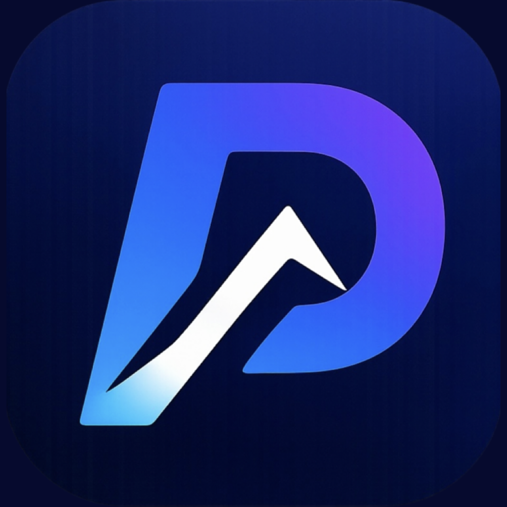
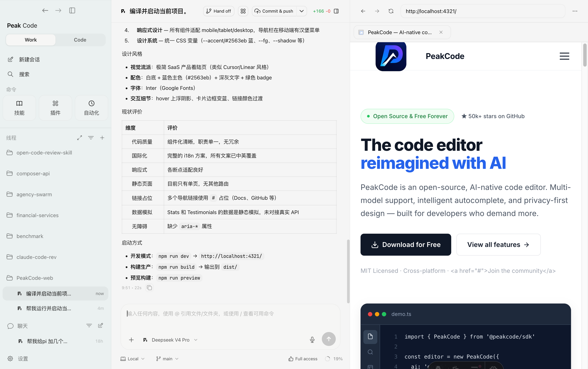

<p align="center">
  
</p>

<h1 align="center">Peak Code</h1>

<p align="center">
  <strong>The open-source GUI for AI coding agents.</strong><br />
  One beautiful interface for Claude Code, Codex, Gemini, Kilo Code, OpenCode, and more.
</p>

<p align="center">
  <a href="./README.zh.md">中文</a> •
  <a href="https://github.com/PeakCode-AI/PeakCode/blob/main/LICENSE">
    
  </a>
  <a href="https://github.com/PeakCode-AI/PeakCode/stargazers">
    
  </a>
  <a href="https://discord.gg/jn4EGJjrvv">
    
  </a>
  <a href="https://github.com/PeakCode-AI/PeakCode/releases">
    
  </a>
</p>

<p align="center">
  <a href="#-quick-start">Quick Start</a> •
  <a href="#-features">Features</a> •
  <a href="https://discord.gg/jn4EGJjrvv">Discord</a> •
  <a href="#-contributing">Contributing</a>
</p>

---



## Why Peak Code?

AI coding agents are powerful, but using them through raw terminals is painful. Peak Code gives you a **polished, local-first desktop and web interface** that wraps your favorite AI agents in a unified experience:

- **No more juggling terminals** — manage multiple AI agent sessions in one window
- **Real-time streaming** — watch code being generated, reviewed, and applied live
- **Built-in Git workflows** — branch, commit, push, and review diffs without leaving the app
- **Your code stays local** — everything runs on your machine, nothing touches the cloud

## Quick Start

### Desktop App (Recommended)

Download from [Releases](https://github.com/PeakCode-AI/PeakCode/releases):

| Platform | Format      |
| -------- | ----------- |
| macOS    | `.dmg`      |
| Windows  | `.exe`      |
| Linux    | `.AppImage` |

### From Source

```bash
git clone https://github.com/PeakCode-AI/PeakCode.git
cd PeakCode
bun install
bun run dev
```

> **Requirements:** [Codex CLI](https://github.com/openai/codex), Node.js 24+ or Bun, Git 2.30+, modern browser.

#### From Source - Windows

On Windows, the server must run on Node.js because Bun does not yet implement ConPTY. The `dev` command handles this automatically. After cloning:

```powershell
# Install dependencies (use public registry if you have a private npm registry configured)
bun install --registry https://registry.npmjs.org

# Build the server (one-time)
bun run build

# Start the dev environment
bun run dev
```

Then open **`http://localhost:5733`** in your browser.

> `bun run dev` auto-detects Windows and runs the Node.js server alongside the Vite frontend — same command as macOS/Linux.

## Features

### Multi-Agent, One Interface

Seamlessly switch between AI coding providers without changing your workflow:

| Provider       | Status    |
| -------------- | --------- |
| Claude Code    | Supported |
| Codex (OpenAI) | Supported |
| Gemini         | Supported |
| Kilo Code      | Supported |
| OpenCode       | Supported |

### Real-Time Streaming

Watch AI agents work in real-time — see code being written, tools being invoked, and results appearing instantly. No polling, no refreshing.

### Git Integration

Built-in version control with branch management, staging, committing, and pushing — all from the same interface where you interact with AI.

### Session Persistence

Sessions survive restarts. Smart checkpointing captures conversation state so you can pick up exactly where you left off.

### Integrated Terminal & Editor

Embedded terminal for command execution and Monaco-based code editor with syntax highlighting — everything you need without leaving the window.

### Cross-Platform

Available as a native **Electron desktop app** (macOS, Windows, Linux) and a **web application** you can self-host.

## Architecture

Peak Code uses a layered client-server architecture:

```
Browser / Desktop (React + Vite + Electron)
        │ WebSocket
        ▼
   Node.js Server
        │ JSON-RPC over stdio
        ▼
   AI Agent Runtime (codex app-server)
```

| Layer              | Key Components                                         |
| ------------------ | ------------------------------------------------------ |
| **Presentation**   | React UI, Zustand stores, theme system                 |
| **Application**    | Native API, event handlers, WebSocket transport        |
| **Domain**         | Orchestration engine, domain events, state projections |
| **Infrastructure** | Provider service, Git service, terminal service        |

See [`.docs/architecture.md`](./.docs/architecture.md) for the full technical deep-dive.

## Development

```bash
# Full dev environment (Web UI + Server)
bun run dev

# Individual services
bun run dev:server         # Server only
bun run dev:web            # Web UI only
bun run dev:desktop        # Desktop app

# Quality checks
bun run test               # Vitest test suite
bun run lint               # oxlint
bun run fmt                # oxfmt formatter
bun run typecheck          # TypeScript type checking

# Desktop distribution
bun run dist:desktop:dmg   # macOS DMG
bun run dist:desktop:linux # Linux AppImage
bun run dist:desktop:win   # Windows installer
```

### Windows Development

`bun run dev` auto-detects Windows and runs the server on Node.js instead of Bun. The workflow is the same as macOS/Linux:

```powershell
# First-time: build the server
bun run build

# Start both frontend and backend
bun run dev
```

Open **`http://localhost:5733`**. After editing server source, rebuild with `bun run build` and restart.

> On Windows, `bun run dev` spawns Vite (via Bun) and the Node.js server as two coordinated processes — no manual terminal juggling or environment variables required.

### Isolated Development

Run alongside an existing Peak Code instance without port conflicts:

```bash
env -u PEAKCODE_AUTH_TOKEN PEAKCODE_PORT_OFFSET=3158 PEAKCODE_NO_BROWSER=1 \
  bun run dev -- --home-dir ./.peakcode-dev --port 58090
```

## Contributing

We welcome contributions! Please read [CONTRIBUTING.md](./CONTRIBUTING.md) before opening issues or PRs.

**Quick guidelines:**

- Keep PRs small (< 200 lines)
- One concern per PR
- Explain _what_ changed and _why_
- Include before/after screenshots for UI changes
- Write tests for new functionality

## Community

- **[GitHub Issues](https://github.com/PeakCode-AI/PeakCode/issues)** — bug reports and feature requests

## Star History

If Peak Code helps your workflow, consider giving it a star — it helps others discover the project.

## License

[MIT](./LICENSE) — use it, modify it, ship it.
